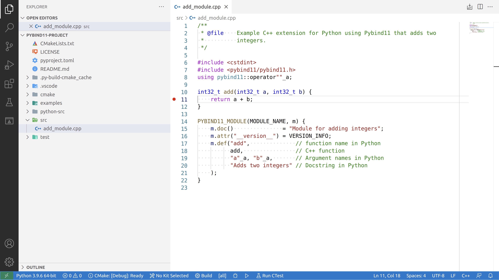
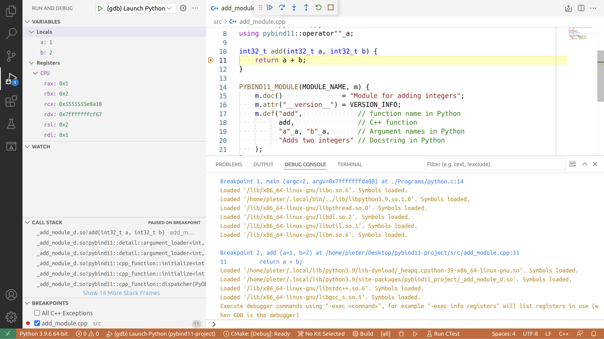
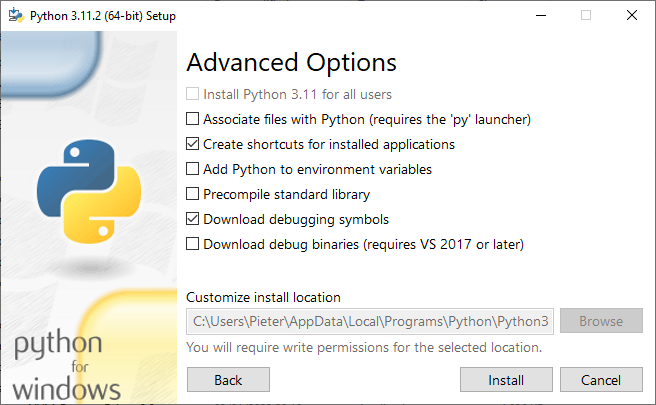

<small>[Index](index.html)</small>

# Debugging

You'll most likely end up in a situation where you'd like to debug your C++
code while it is being called from Python. For this reason, py-build-cmake
allows you to install multiple configurations of your project (e.g. `Debug` and
`Release` builds). This page covers how to get your package ready for debugging.

You can follow along by opening the `examples/pybind11-project` folder in a new
VSCode workspace. The instructions in the following sections apply to Linux and
macOS. More information for debugging on Windows can be found at the bottom of
this page, in the [Windows](#windows) section.

## pyproject.toml

In `pyproject.toml` configuration file, specify a multi-config CMake generator,
and set the configurations to `Release` and `Debug`.  
The debug and release versions of the extension module cannot have the same name,
so tell CMake to add a `_d` suffix after the name of the debug version.

```toml
[tool.py-build-cmake.linux.cmake]
generator = "Ninja Multi-Config"
config = ["Debug", "Release"]
options = { "CMAKE_DEBUG_POSTFIX:STRING" = "_d" }
```

## CMakeLists.txt and C++ code

Since the name of the Python module now depends on whether it's a debug build or
not, we have to make sure that the Python bindings use the correct name:
In your CMakeLists.txt script, add a macro that defines the `MODULE_NAME` as the
base name of the extension module (which includes the `_d` suffix):

```cmake
pybind11_add_module(_add_module MODULE "src/add_module.cpp")
set_target_properties(_add_module PROPERTIES
    DEBUG_POSTFIX "${CMAKE_DEBUG_POSTFIX}${PYTHON_MODULE_DEBUG_POSTFIX}")
target_compile_definitions(_add_module PRIVATE
    MODULE_NAME=$<TARGET_FILE_BASE_NAME:_add_module>)
```

In your C++ code, use this macro to define your module:
```cpp
PYBIND11_MODULE(MODULE_NAME, m) {
    // ...
}
```

## Python wrapper

Finally, choose which version to load in your Python wrapper, for example by
checking whether an environment variable is set. To make sure that the generated
stubs don't try to include both the release and the debug version, add a check
for `typing.TYPE_CHECKING`:
```py
import os
import typing
if not typing.TYPE_CHECKING and os.getenv('PYBIND11_PROJECT_PYTHON_DEBUG'):
    from ._add_module_d import *
    from ._add_module_d import __version__
else:
    from ._add_module import *
    from ._add_module import __version__
```

## Building and installing the package

By default, `pip` and `build` copy your code source files to a temporary folder
before building, which means that the debugging symbols point to source files
in these (long deleted) temporary folders, which means your debugger won't be
able to locate the source code while debugging. To get around this, tell `pip`
and `build` not to use a temporary build folder using the respective
`--no-build-isolation` and `--no-isolation` flags.

## Debugging in VSCode

First, create a task to build the package. This task will be executed before
each debug session. In `.vscode/tasks.json`, add:

```json
{
    "version": "2.0.0",
    "tasks": [
        {
            "label": "Install package (development)",
            "command": "${command:python.interpreterPath} -m pip install -e . --no-build-isolation",
            "type": "shell",
            "args": [],
            "problemMatcher": [],
            "presentation": {
                "reveal": "silent"
            },
            "group": "build"
        }
    ]
}
```

Next, define the debug configuration in `.vscode/launch.json`:
```json
{
    "version": "0.2.0",
    "configurations": [
        {
            "name": "(gdb) Launch Python",
            "type": "cppdbg",
            "request": "launch",
            "program": "${command:python.interpreterPath}",
            "args": [
                "examples/add_example.py"
            ],
            "stopAtEntry": false,
            "cwd": "${workspaceFolder}",
            "environment": [
                {"name": "PYBIND11_PROJECT_PYTHON_DEBUG", "value": "1"}
            ],
            "externalConsole": false,
            "MIMode": "gdb",
            "setupCommands": [
                {
                    "description": "Enable pretty-printing for gdb",
                    "text": "-enable-pretty-printing",
                    "ignoreFailures": true
                },
                {
                    "description": "Set Disassembly Flavor to Intel",
                    "text": "-gdb-set disassembly-flavor intel",
                    "ignoreFailures": true
                }
            ],
            "preLaunchTask": "Install package (development)",
        }
    ]
}
```
Note how the program to debug is the Python interpreter itself. The Python
script to execute is passed as an argument.  
The environment variable `PYBIND11_PROJECT_PYTHON_DEBUG` is set, which causes
the Python wrapper to load the debug version of the extension module, as
explained above.

Now open `src/add_module.cpp` and add a breakpoint in the `add` function:



If you now press <kbd>F5</kbd> to launch the debugger, the execution will be
paused when the Python script calls the `add` function, and you can debug the
program as usual:



## Distributing debug information separately

Depending on the size of your extension, the debugging information could take
up hundreds of megabytes, so it may not be desirable to include it in the
main distribution.

The following CMake function can be used to strip the debugging information to
a separate file, that can be packaged separately.
```cmake
# Strip and install debug information
function(install_debug_syms target component dest_lib dest_bin)
    if (MSVC)
        install(FILES "$<TARGET_PDB_FILE:${target}>"
            DESTINATION ${dest_bin}
            CONFIGURATIONS Debug RelWithDebInfo
            COMPONENT ${component}
            OPTIONAL EXCLUDE_FROM_ALL)
    elseif (CMAKE_STRIP AND CMAKE_OBJCOPY)
        set(DEBUG_FILE "$<TARGET_FILE_NAME:${target}>.debug")
        add_custom_command(TARGET ${target} POST_BUILD
            COMMAND "${CMAKE_STRIP}" "--only-keep-debug" "$<TARGET_FILE:${target}>" "-o" "${DEBUG_FILE}"
            COMMAND "${CMAKE_STRIP}" "--strip-debug" "$<TARGET_FILE:${target}>"
            COMMAND "${CMAKE_OBJCOPY}" "--add-gnu-debuglink=${DEBUG_FILE}" "$<TARGET_FILE:${target}>"
            WORKING_DIRECTORY $<TARGET_FILE_DIR:${target}>)
        install(FILES "$<TARGET_FILE_DIR:${target}>/${DEBUG_FILE}"
            DESTINATION ${dest_lib}
            CONFIGURATIONS Debug RelWithDebInfo
            COMPONENT ${component}
            EXCLUDE_FROM_ALL)
    endif()
endfunction()
```

To package the file in a separate Python package, you can add it to a separate
CMake installation component, and then package it using the py-build-cmake
`build_component` backend. See [this page](Components.html) for more
information.

---

## Windows

Most of the points touched upon in the previous sections also apply to Windows,
but there are some differences you need to keep in mind.

### Python installation

When installing Python, be sure to install the debug symbols.



### Different Python ABIs

When building an extension in Debug mode on Windows, it will link to the debug
version of the Python library (`python3.x_d.lib`), which has a different ABI
than the standard Python ABI. This means that the extension can only be used
with the debug interpreter (`python_d.exe`), and requires that all other
extensions use the debug ABI as well.

Since we're only interested in debugging our own extension, not third-party
extensions or the Python interpreter itself, this is not what we want. Instead,
we'll build our extension in RelWithDebInfo mode, but overriding some of the
optimization options, in order to get a non-optimized extension with debug
symbols, but using the ordinary Python ABI.

In your `pyproject.toml` file, add the following options:
```toml
[tool.py-build-cmake.windows.cmake] # Windows-specific options
config = ["RelWithDebInfo", "Release"]
[tool.py-build-cmake.windows.cmake.options]
CMAKE_CXX_FLAGS_RELWITHDEBINFO = "/Zi /Ob0 /Od /RTC1"
CMAKE_MODULE_LINKER_FLAGS_RELWITHDEBINFO = "/INCREMENTAL:NO /OPT:REF /DEBUG:FULL"
CMAKE_RELWITHDEBINFO_POSTFIX = "_d"
```
For more information about the CMake variables, see the [cmake-variables(7)](https://cmake.org/cmake/help/latest/manual/cmake-variables.7.html)
documentation. For more information about the compiler and linker flags,
see the Microsoft [How to: Debug a Release Build](https://learn.microsoft.com/en-us/cpp/build/how-to-debug-a-release-build)
guide and the MSVC documentation
([Compiler](https://learn.microsoft.com/en-us/cpp/build/reference/compiler-options),
[Linker](https://learn.microsoft.com/en-us/cpp/build/reference/linker-options)).

### Debug symbols

The MSVC linker generates a separate file, called the program database (PDB),
that contains the debugging symbols of the extension module. If you want to
be able to step through the C++ code of the extension, you need to include
it in the Python package. To do so, add the following to `CMakeLists.txt`:
```cmake
# Install the debug file for the Python module (Windows only)
install(FILES $<TARGET_PDB_FILE:_add_module>
        EXCLUDE_FROM_ALL
        COMPONENT python_modules
        DESTINATION ${PY_BUILD_CMAKE_IMPORT_NAME}
        OPTIONAL)
```
This will install the PDB file in the same folder as the extension module.
Since the PDB file only exists in Windows and in Debug or RelWithDebInfo
builds, we use the `OPTIONAL` keyword, so CMake does not raise an error
if it cannot find the file during installation.

### VSCode debug configuration

The VSCode debug configuration listed in the [Debugging in VSCode](#debugging-in-vscode)
section applies to GDB specifically. To use the Visual Studio debugger on
Windows, include the following configuration in `.vscode/launch.json`:
```json
{
    "version": "0.2.0",
    "configurations": [
        {
            "name": "(Windows) Launch Python",
            "type": "cppvsdbg",
            "request": "launch",
            "program": "${command:python.interpreterPath}",
            "args": [
                "examples/add_example.py"
            ],
            "stopAtEntry": false,
            "cwd": "${workspaceFolder}",
            "environment": [
                {"name": "PYBIND11_PROJECT_PYTHON_DEBUG", "value": "1"}
            ],
            "console": "integratedTerminal",
            "preLaunchTask": "Install package (development)",
        }
    ]
}
```

### Packaging debug information

The PDB files are installed using the CMake code in the [Debug symbols](#debug-symbols)
section. To package it separately, the principle is the same as for Linux and
macOS: change the installation `COMPONENT` and use the
`py_build_cmake.build_component` build backend.

The `install_debug_syms` function listed in the section [Distributing debug information separately](#distributing-debug-information-separately)
also includes the necessary code to install the Windows PDB files.

### Virtual environments

On Windows, the `.venv/Scripts/python.exe` binary is not actually the Python
interpreter itself, but a wrapper program called `venvlauncher.exe`. It does
not seem like the debug symbols for this program are installed automatically,
so debugging inside of a virtual environment is not possible out of the box.
