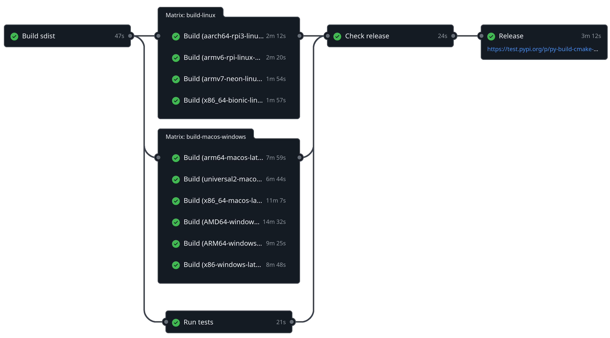

Examples
========

.. grid:: 2 2 3 3
   :margin: 4 4 0 0
   :gutter: 1

   .. grid-item-card:: minimal
      :link: https://github.com/tttapa/py-build-cmake/tree/main/examples/minimal

      Bite-sized example using CMake and py-build-cmake to build a Python extension
      module in C. Includes a line-by-line explanation of the configuration file,
      and a discussion of the project's file structure.
      This manual approach is not recommended for real-world projects, but the
      simplicity makes it well suited for an in-depth explanation of py-build-cmake.

   .. grid-item-card:: pybind11-project
      :link: https://github.com/tttapa/py-build-cmake/tree/main/examples/pybind11-project

      A Python extension module written in C++, with bindings generated by the
      pybind11 library. This example is a good choice if you want to create a Python
      interface to C++ functions or classes. It includes some nice features such
      as automatic generation of PEP 561 stubs for type checking and autocompletion,
      unit tests using pytest, a configuration for debugging the C++ code,
      and example configurations for cross-compilation.

   .. grid-item-card:: py-build-cmake-example
      :link: https://github.com/tttapa/py-build-cmake-example

      A full example that resembles a more complete, real-world Python project.
      It uses the Conan package manager for C++ dependencies, binds C++ code to Python
      using pybind11, generates typed stub files, and uses continuous integration (CI)
      to build and deploy the Wheel packages to PyPI.
      The GitHub actions CI workflow (cross-)compiles the package for all major
      platforms, including ARMv6 (Raspberry Pi), ARMv7 and AArch64.

   .. grid-item-card:: nanobind-project
      :link: https://github.com/tttapa/py-build-cmake/tree/main/examples/nanobind-project

      Very similar to the pybind11-project example,
      but using the more modern (and more performant) nanobind library to generate the
      Python bindings instead of pybind11.

   .. grid-item-card:: swig-project
      :link: https://github.com/tttapa/py-build-cmake/tree/main/examples/swig-project

      Very similar to the pybind11-project and nanobind-project examples,
      but using the SWIG tool to generate the Python bindings instead of pybind11 or
      nanobind. Since SWIG targets many different programming languages, this may be
      a good choice if you want to reuse the same bindings for other languages.

   .. grid-item-card:: minimal-program
      :link: https://github.com/tttapa/py-build-cmake/tree/main/examples/minimal-program

      Uses CMake and py-build-cmake to build a C++ program and packages it as a
      Python package. The program can then be installed using a single
      ``pip install`` command, and is automatically added to the ``PATH``.

   .. grid-item-card:: minimal-debug-component
      :link: https://github.com/tttapa/py-build-cmake/tree/main/examples/minimal-debug-component

      Largely the same as the minimal example, but uses
      py-build-cmake's ``build_component`` backend
      to package the debugging symbols in a separate, optional package.

To see how py-build-cmake is used in real-world projects, have a look at the
following packages:

- `alpaqa <https://github.com/kul-optec/alpaqa/tree/develop>`_
- `QPALM <https://github.com/kul-optec/QPALM>`_

****

   GitHub Action workflow to build, test and deploy the generated Python package (from the https://github.com/tttapa/py-build-cmake-example repository).
